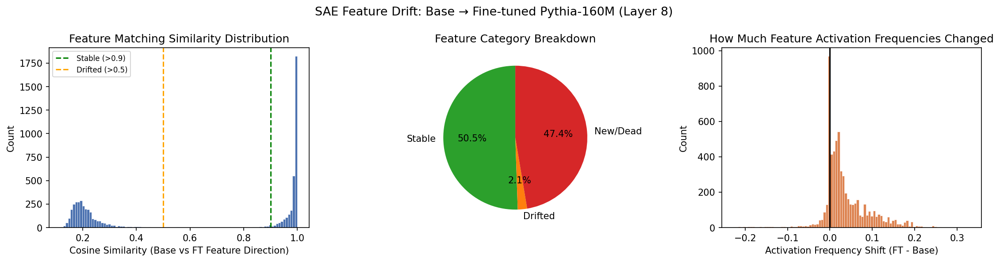
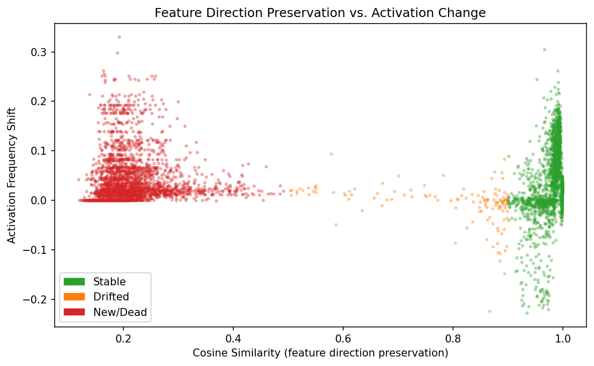

# SAE Feature Drift in Fine-Tuned Pythia-160M

A mechanistic interpretability study using **Sparse Autoencoders (SAEs)** to track how internal representations change when `pythia-160m` is fine-tuned on Python code. The project trains matched SAEs on both the base and fine-tuned model, then compares feature directions and activation frequencies to characterise which features are stable, drifted, or replaced.

---

## Research Question

When a language model is fine-tuned on a narrow domain (Python code), what happens to the internal features it uses to process language?

- Do most features survive fine-tuning intact?
- Which features shift to represent new, code-specific concepts?
- Can we identify features that change in unexpected, unintended ways?

---

## Method Overview

```
Base Pythia-160M ──► Train SAE (base) ──────────────────────────────┐
                                                                     ├──► Compare Features (04)
Fine-tuned Pythia-160M ──► Train SAE (finetuned) ───────────────────┘
       ▲
       │
Fine-tune on Python code (02)
```

SAEs are trained on the **layer 8 residual stream** (`blocks.8.hook_resid_post`) — an upper-middle layer rich in semantic features. Each SAE has **6,144 features** (8× expansion of d_model=768). Feature correspondence is established by matching decoder directions via cosine similarity, and activation frequency shifts are measured on a shared held-out corpus.

---

## Pipeline

Run the scripts in order:

| Script | Description |
|--------|-------------|
| `01_train_sae_base.py` | Train SAE on base `pythia-160m` (OpenWebText, 5M tokens) |
| `02_finetune.py` | Fine-tune `pythia-160m` on Python code (`flytech/python-codes-25k`, 1000 steps) |
| `03_train_sae_finetuned.py` | Train SAE on the fine-tuned model (same config and dataset as step 1) |
| `04_compare_features.py` | Match features across SAEs; compute cosine similarity and activation frequency shifts; generate figures |
| `05_qualitative_analysis.py` | Find top-activating token sequences for features of interest; produce human-readable reports |

---

## Setup

**Requirements:** Python 3.10+, a CUDA GPU with ≥ 16 GB VRAM recommended (CPU fallback available but slow).

```bash
git clone https://github.com/AaravJain62677/SAE_Pythia_MI.git
cd SAE_Pythia_MI
pip install -r requirements.txt
```

**Dependencies** (from `requirements.txt`):

```
transformer-lens>=2.0.0
sae-lens>=6.0.0
torch>=2.0.0
datasets>=2.14.0
transformers>=4.35.0
accelerate>=0.24.0
wandb
numpy, pandas, matplotlib, seaborn, scikit-learn, tqdm, einops
```

---

## Running the Pipeline

```bash
# Step 1 — Train SAE on base model (~1–2 hrs on A100)
python 01_train_sae_base.py

# Step 2 — Fine-tune Pythia on Python code (~30 min)
python 02_finetune.py

# Step 3 — Train SAE on fine-tuned model (~1–2 hrs)
python 03_train_sae_finetuned.py

# Step 4 — Compare features and generate plots
python 04_compare_features.py

# Step 5 — Qualitative analysis of individual features
python 05_qualitative_analysis.py
```

Checkpoints are saved to `checkpoints/` and results to `results/`.

---

## Outputs

```
checkpoints/
  sae_base/               # SAE trained on base Pythia
  pythia_finetuned/       # Fine-tuned Pythia weights
  sae_finetuned/          # SAE trained on fine-tuned Pythia

results/
  feature_comparison.csv          # Per-feature: cosine sim, freq shift, category
  summary_stats.json              # Aggregate statistics
  figures/
    fig1_feature_drift_overview.png   # Cosine sim histogram + category pie + freq shift dist
    fig2_sim_vs_freq_shift.png        # Scatter: direction preservation vs activation change
  qualitative/
    feature_XXXX.txt                  # Top-activating token windows per feature
    QUALITATIVE_SUMMARY.txt           # Human-readable report of most interesting features
```

### Feature Categories

Features are classified by cosine similarity between matched base and fine-tuned decoder directions:

| Category | Cosine Similarity | Interpretation |
|----------|------------------|----------------|
| **Stable** | ≥ 0.9 | Feature direction essentially unchanged by fine-tuning |
| **Drifted** | 0.5 – 0.9 | Feature exists but has shifted to represent something related but different |
| **New / Dead** | < 0.5 | Feature was replaced by a new concept, or died |

---

## Model & Data Details

| Component | Value |
|-----------|-------|
| Base model | `EleutherAI/pythia-160m` (160M params, d_model=768, 12 layers) |
| SAE hook point | `blocks.8.hook_resid_post` |
| SAE features | 6,144 (8× expansion) |
| SAE L1 coefficient | 8 |
| Pre-training corpus | `Skylion007/openwebtext` |
| Fine-tuning corpus | `flytech/python-codes-25k` |
| Fine-tuning steps | 1,000 (effective batch ≈ 32K tokens) |
| Evaluation corpus | 500 OpenWebText + 200 Python code samples |

---

## Results

### Feature Drift Overview



The cosine similarity histogram shows a strongly bimodal distribution: most features either survive fine-tuning with near-perfect direction preservation (spike near 1.0) or are effectively replaced (broad mass below 0.3). Very few features fall in the intermediate "drifted" range. The breakdown is roughly **50.5% stable**, **47.4% new/dead**, and **2.1% drifted** — suggesting that fine-tuning on Python code is a relatively disruptive operation at this layer, replacing nearly half the feature dictionary rather than smoothly shifting existing features.

The activation frequency shift histogram is right-skewed with a sharp peak at zero: most features do not change how often they fire, but a meaningful tail of features increases substantially in frequency after fine-tuning (likely newly code-relevant features).

### Feature Direction Preservation vs. Activation Change



The scatter plot reveals a clear structural pattern. New/Dead features (red, cosine sim < 0.5) cluster on the left and show high *positive* frequency shifts — these are features that have been reassigned to fire on code-specific token patterns. Stable features (green, cosine sim ≥ 0.9) cluster tightly at x ≈ 1.0 but show a wide spread in frequency shift, meaning many semantically preserved features nonetheless change *how often* they are recruited. The small drifted population (orange) sits in between with modest frequency changes. This two-dimensional picture suggests fine-tuning primarily works by replacing features wholesale rather than rotating existing ones.

---

## Key Design Choices

**Why layer 8?** Layer 8 of a 12-layer model sits in the upper-middle range where residual stream features tend to be semantically rich (syntactic features are more prominent in early layers; positional and task-level features emerge in the final layers). This makes it a good place to observe domain-level conceptual drift.

**Why cosine similarity for matching?** SAE decoder directions represent the "meaning" of a feature in model space. Cosine similarity measures how much that direction rotates after fine-tuning, independent of feature scale — a natural metric for direction preservation.

**Why measure activation frequency shift?** A feature can preserve its direction but fire much more (or less) often after fine-tuning. Frequency shift captures this second dimension of change: *usage* as opposed to *meaning*.

---

## Limitations

- Feature matching is **greedy** (argmax), not bijective. Multiple base features may map to the same fine-tuned feature; a bipartite matching would give cleaner correspondence.
- The fine-tune is **relatively short** (1,000 steps). Dramatic drift may require more training.
- SAEs trained on different models are not guaranteed to produce comparable feature dictionaries even with matched architecture and training data — correspondence is approximate.
- `TransformerLens.from_pretrained` with a local HuggingFace checkpoint (used in scripts 04 and 05) requires passing the loaded HF model as `hf_model=` argument; see the note in `05_qualitative_analysis.py` for the correct pattern.

---
